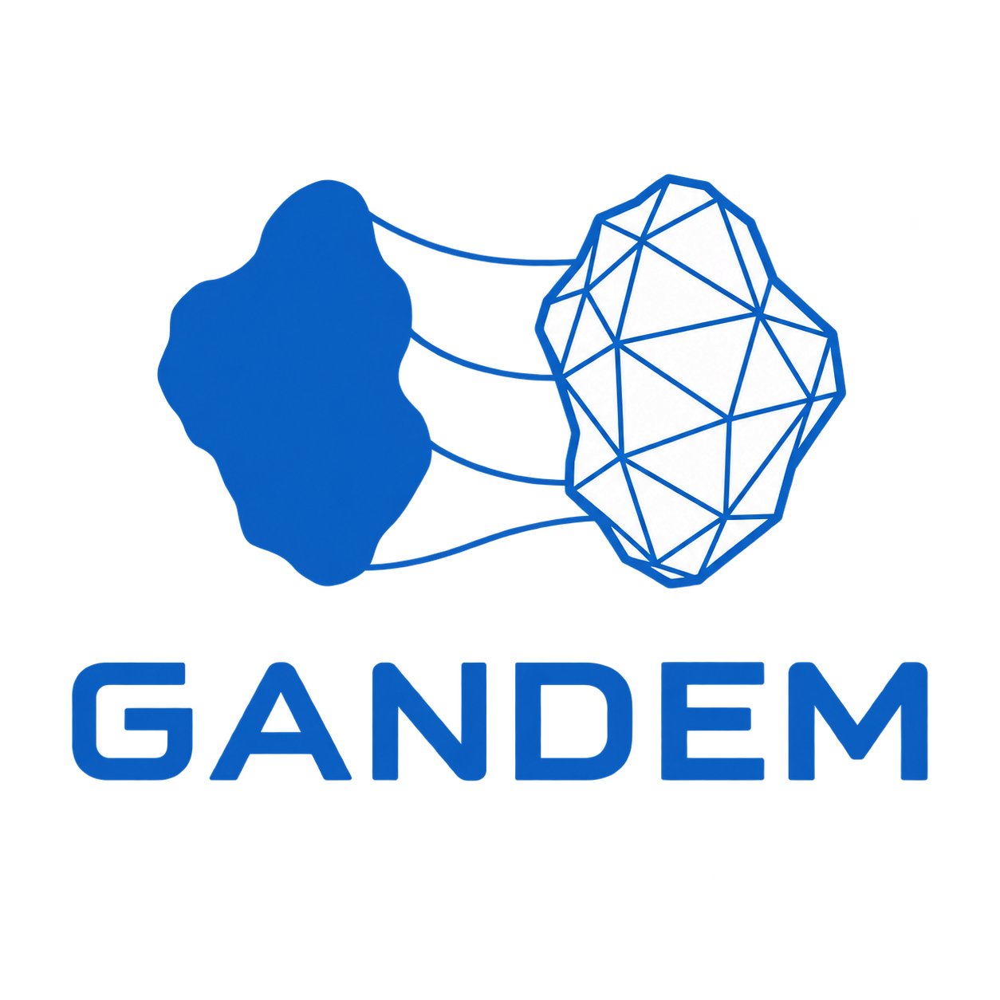

<p align="center">
  
</p>

# GAN-DEM

GAN-DEM reconstructs statistically representative 3D particle geometries from
2D particle projections for discrete element method (DEM) workflows. It
contains tools to prepare silhouettes, train a projection-based GAN, convert
generated voxel grids into meshes, and select a mesh subset with target shape
statistics.

## What it does

| Stage                        | Package            | Output                                           |
| ---------------------------- | ------------------ | ------------------------------------------------ |
| Prepare particle silhouettes | `gandem.pre`     | Binary 2D image files                            |
| Train and generate           | `gandem.ganular` | Checkpoints and 3D probability grids (`.npy`)  |
| Clean and select meshes      | `gandem.evopop`  | Processed STL meshes and a representative subset |

## Install

Python 3.10 or newer is required. Install from a clone for the version in this
repository:

```bash
git clone https://github.com/uob-positron-imaging-centre/GANDEM.git
cd GAN-DEM
python -m venv .venv
source .venv/bin/activate  # Windows PowerShell: .venv\\Scripts\\Activate.ps1
python -m pip install --upgrade pip
python -m pip install -e ".[docs]"
```

A CUDA GPU, Apple Silicon GPU, or CPU is selected automatically by PyTorch.
GPU acceleration is strongly recommended for training. Mesh repair additionally
uses PyVista and PyMeshFix, which may need platform-specific system graphics
libraries in headless environments.

## Start a training run

The training directory must contain supported image files directly in that
directory: `.jpg`, `.jpeg`, `.png`, `.bmp`, `.tif`, or `.tiff`.

```bash
gandem-train cropped_particles/MCC_Vivapur_102 \
  --output-dir outputs/example \
  --epochs 500 \
  --object-batch-size 2 \
  --views-per-object 2 \
  --updates-per-epoch 100 \
  --seed 42
```

`--batch-size` remains an alias for `--object-batch-size`. Run
`gandem-train --help` for all command options.

Read the [documentation](https://abhirup-roy.github.io/GAN-DEM/) for the
end-to-end tutorial, output layout, mesh-processing workflow, quality checks,
and API reference.

## Safety and reproducibility

- Treat `.pth` and `.pt` files as executable data: only load checkpoints from
  trusted sources.
- Save `hyperparameters.json`, the training checkpoint, source images, and the
  GAN-DEM version together for reproducible runs.
- Quality reports are advisory diagnostics, not a guarantee that a mesh is
  physically valid or suitable for a particular DEM solver.
